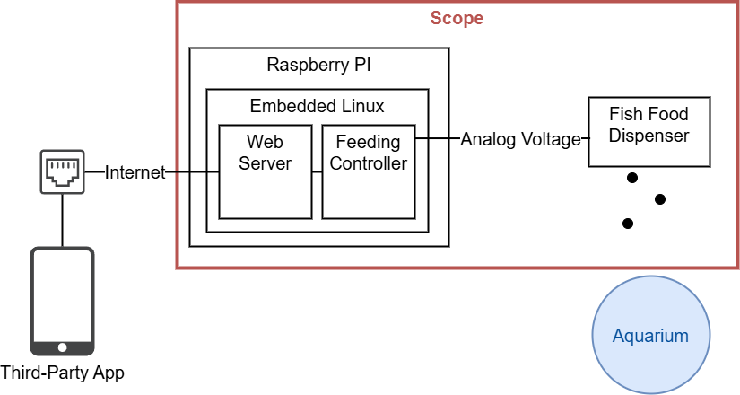

# System Description and Scope

The Target of Evaluation (ToE) is an automated fish feeding system.
It is usually used to dispense food to fish tanks in small farming businesses. 

The ToE consists of

* A mechanical fish food dispenser which can be controlled by an analog voltage
* a Raspberry Pi running two applications
  * A "Feeding Controller" which controls the analog voltage output based on a
    programmed schedule.
  * A Web Server which provides a REST API to allow third party applications to
    read and modify the Feeding Controller's schedule.

